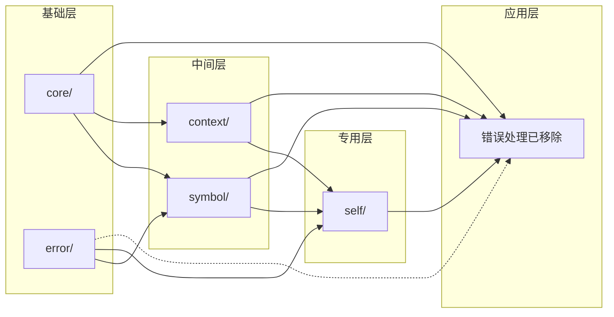

# Semantic Check 文件分类图表

## 功能分类图

```mermaid
graph TD
    A[Semantic Check 模块] --> B[核心基础组件 core/]
    A --> C[符号表管理 symbol/]
    A --> D[错误处理 error/]
    A --> E[Self关键字处理 self/]
    A --> F[分析器实现 analyzer/]
    A --> G[上下文信息 context/]
    
    B --> B1[Context.java<br/>语义分析上下文枚举]
    B --> B2[ContextType.java<br/>上下文类型枚举]
    B --> B3[Namespace.java<br/>命名空间枚举]
    B --> B4[Type.java<br/>类型表示类]
    
    C --> C1[Symbol.java<br/>符号表条目类]
    C --> C2[SymbolKind.java<br/>符号类型枚举]
    C --> C3[NamespaceSymbolTable.java<br/>多命名空间符号表实现]
    C --> C4[NamespaceScope.java<br/>命名空间作用域跟踪类]
    
    D --> D1[ErrorType.java<br/>通用错误类型枚举]
    D --> D2[SemanticError.java<br/>语义错误类]
    D --> D3[SemanticException.java<br/>语义分析异常类]
    
    E --> E1[SelfChecker.java<br/>self和Self检查器]
    E --> E2[SelfErrorType.java<br/>self相关错误类型]
    E --> E3[SelfSemanticAnalyzer.java<br/>Self语义分析器]
    
    F --> F1[NamespaceAnalyzer.java<br/>命名空间语义分析器实现<br/>（错误处理功能已移除）]
    F --> F2[SemanticAnalyzerVisits.java<br/>语义分析器访问方法实现]
    
    G --> G1[ContextInfo.java<br/>上下文信息类]
```

## 依赖关系图

## 文件功能详细说明

### 核心基础组件 (core/)
| 文件 | 行数 | 主要功能 | 依赖 |
|------|------|----------|------|
| Context.java | 8 | 定义语义分析上下文枚举 | 无 |
| ContextType.java | 8 | 定义上下文类型枚举 | 无 |
| Namespace.java | 16 | 定义命名空间枚举 | 无 |
| Type.java | 115 | 类型表示和操作 | 无 |

### 符号表管理 (symbol/)
| 文件 | 行数 | 主要功能 | 依赖 |
|------|------|----------|------|
| Symbol.java | 73 | 符号表条目表示 | core/, error/ |
| SymbolKind.java | 58 | 符号类型枚举 | core/ |
| NamespaceSymbolTable.java | 255 | 多命名空间符号表实现 | core/, error/ |
| NamespaceScope.java | 94 | 命名空间作用域跟踪 | core/ |

### 错误处理 (error/)
| 文件 | 行数 | 主要功能 | 依赖 |
|------|------|----------|------|
| ErrorType.java | 35 | 通用错误类型枚举 | 无 |
| SemanticError.java | 32 | 语义错误表示 | core/ |
| SemanticException.java | 20 | 语义分析异常 | self/ |

### Self关键字处理 (self/)
| 文件 | 行数 | 主要功能 | 依赖 |
|------|------|----------|------|
| SelfChecker.java | 54 | self和Self检查器 | core/, error/ |
| SelfErrorType.java | 22 | self相关错误类型 | 无 |
| SelfSemanticAnalyzer.java | 122 | Self语义分析器 | core/, error/, context/ |

### 分析器实现 (analyzer/)
| 文件 | 行数 | 主要功能 | 依赖 |
|------|------|----------|------|
| NamespaceAnalyzer.java | ~1200 | 命名空间语义分析器实现（错误处理功能已移除） | core/, symbol/, self/, context/ |
| SemanticAnalyzerVisits.java | 1113 | 语义分析器访问方法实现 | 所有其他模块 |

### 上下文信息 (context/)
| 文件 | 行数 | 主要功能 | 依赖 |
|------|------|----------|------|
| ContextInfo.java | 41 | 上下文信息管理 | core/ |

## 代码复杂度分析

| 模块 | 总行数 | 平均文件行数 | 复杂度评级 |
|------|--------|--------------|------------|
| core/ | 147 | 36.75 | 低 |
| symbol/ | 480 | 120 | 中 |
| error/ | 87 | 29 | 低 |
| self/ | 198 | 66 | 中 |
| analyzer/ | 1855 | 618.33 | 高 |
| context/ | 41 | 41 | 低 |

## 重构优先级

1. **高优先级**: analyzer/ - 代码量最大，复杂度最高，最需要重组
2. **中优先级**: symbol/, self/ - 功能相对独立，适合单独重构
3. **低优先级**: core/, error/, context/ - 功能简单，依赖关系清晰

## 重构收益

1. **可维护性提升**: 相关功能集中，便于定位和修改
2. **代码复用**: 模块化设计提高代码复用率
3. **测试友好**: 独立模块便于单元测试
4. **新人友好**: 清晰的目录结构降低学习成本